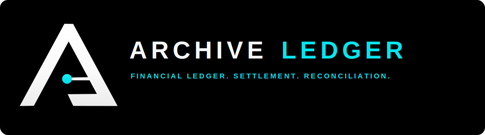

<p align="center">
  
</p>

# Archive-Ledger

Archive-Ledger는 Archive Platform Ecosystem에서 **이벤트 기반 거래 처리, 복식 원장, 정산, 대사, 승인 callback, workforce 기반 처리량 관제**를 담당하는 Spring Boot 금융 백엔드입니다.

Archive-Nexus direct 비용 이벤트, Archive-Logistics 물류비 확정 이벤트, Archive-Market 매출/결제/환불/클레임 이벤트를 수신해 `finance_transaction`으로 정규화하고, debit/credit 균형이 맞는 `ledger_entry`를 생성합니다. 이후 정산 배치, 대사, 승인 callback, settlement agency 수익/비용 요약을 제공합니다.

> 모든 데이터는 Synthetic Data / Demo Data입니다. 실제 카드번호, 계좌번호, 개인정보, 실제 금융 데이터, 실제 배송/위치 데이터는 사용하지 않습니다.

## 핵심 역할

- Archive-Nexus direct 비용 이벤트 수신
- Archive-Logistics native/compatibility 물류비 이벤트 수신
- Archive-Market 매출/결제/환불/클레임 이벤트 수신
- idempotency key 기반 중복 방지
- `finance_transaction` 생성
- debit/credit 복식 원장 `ledger_entry` 생성
- `SETTLEMENT_READY` 대상 정산 배치
- `APPROVAL_REQUIRED` 정산 제외 및 승인 callback 처리
- reconciliation mismatch 계산
- Operational Workforce 기반 capacity/backlog/productivity 계산
- settlement agency 수익/비용 요약

## Archive Platform 내 위치

```text
Archive-Market
  -> 매출/결제/환불/클레임 이벤트
  -> Archive-Ledger

Archive-Nexus
  -> 제조/품질/정비/비용 이벤트
  -> Archive-Ledger

Archive-Logistics
  -> 물류비/긴급배송/지연/우회/콜드체인 비용 이벤트
  -> Archive-Ledger

Archive-Ledger
  -> 거래 정규화
  -> 복식 원장
  -> 정산
  -> 대사
  -> 승인 callback
  -> workforce capacity / backlog
  -> ArchiveOS 관제 대상
```

## Core Flow

```text
External Synthetic Events
  -> Ledger Event Receiver
     -> idempotency / duplicate guard
     -> hop guard
     -> source contract normalization
  -> finance_transaction
  -> double-entry ledger_entry
  -> policy decision
     -> SETTLEMENT_READY
        -> daily settlement batch
        -> reconciliation
     -> APPROVAL_REQUIRED
        -> approval_request
        -> ArchiveOS callback
     -> DUPLICATE / FAILED
        -> audit_log
  -> operations summary
  -> settlement agency summary
  -> workforce capacity / backlog summary
```

| Flow | 입력 이벤트 | Ledger 처리 |
| --- | --- | --- |
| `NEXUS_DIRECT` | `MAINTENANCE_COMPLETED`, `QUALITY_DEFECT_DETECTED`, `MATERIAL_CONSUMED`, `EMERGENCY_PURCHASE_REQUESTED`, `CORPORATE_CARD_USED`, `VENDOR_PAYMENT_REQUESTED`, `PRODUCTION_COMPLETED` | 제조/품질/정비/구매 비용 이벤트를 금융 거래로 정규화하고 복식 원장을 생성합니다. |
| `LOGISTICS_NATIVE` | `LOGISTICS_COST_CONFIRMED`, `URGENT_DELIVERY_COST_CONFIRMED`, `DELAY_PENALTY_CONFIRMED`, `ROUTE_DEVIATION_COST_CONFIRMED`, `COLD_CHAIN_RISK_COST_CONFIRMED` | Archive-Logistics 물류비 확정 이벤트를 비용 거래로 반영하고 승인 필요 여부와 정산 제외 규칙을 적용합니다. |
| `LOGISTICS_COMPAT` | `source=Archive-Logitics`, `eventType=LOGISTICS_DISPATCHED` | 기존 호환 계약을 유지하며 물류비 확정 거래와 동일한 흐름으로 처리합니다. 외부 표기는 Archive-Logistics를 사용합니다. |
| `MARKET_COMMERCE` | `SALES_REVENUE_CONFIRMED`, `PAYMENT_CAPTURED`, `REFUND_REQUESTED`, `CLAIM_COMPENSATION_CONFIRMED`, `MARKET_SERVICE_FEE_PAID`, `PAYMENT_PROCESSING_FEE_PAID` | 매출, 결제, 환불, 클레임, 수수료 이벤트를 수익/비용 거래로 정규화합니다. |
| `APPROVAL` | `APPROVAL_REQUIRED`, `/api/approvals/callback` | 승인 필요 거래를 정산에서 제외하고, 승인 callback 이후 `SETTLEMENT_READY` 또는 `REJECTED`로 전이합니다. |
| `WORKFORCE` | `WORKFORCE_ALLOCATION_ASSIGNED`, `/api/workforce/workday/run` | synthetic workforce capacity에 따라 처리량, backlog, payroll cost, productivity, bottleneck을 계산합니다. |

## 주요 API

| Method | Path | 설명 |
| --- | --- | --- |
| `POST` | `/api/events/nexus` | Archive-Nexus direct 이벤트 단건 수신 |
| `POST` | `/api/events/nexus/bulk` | Archive-Nexus direct 이벤트 bulk 수신 |
| `POST` | `/api/events/logistics` | Archive-Logistics 이벤트 단건 수신 |
| `POST` | `/api/events/logistics/bulk` | Archive-Logistics 이벤트 bulk 수신 |
| `POST` | `/api/events/market` | Archive-Market 이벤트 단건 수신 |
| `POST` | `/api/events/market/bulk` | Archive-Market 이벤트 bulk 수신 |
| `GET` | `/api/events/received` | 수신 이벤트 조회, `source` 필터 지원 |
| `GET` | `/api/transactions` | 거래 조회, `status`, `source` 필터 지원 |
| `GET` | `/api/ledger/entries` | 원장 entry 조회 |
| `GET` | `/api/ledger/summary` | debit/credit 요약 |
| `POST` | `/api/settlements/daily/run` | 일 정산 실행 |
| `GET` | `/api/settlements` | 정산 배치 조회 |
| `POST` | `/api/reconciliation/daily` | 일 대사 실행 |
| `GET` | `/api/reconciliation/summary` | 최신 대사 결과 조회 |
| `POST` | `/api/approvals/callback` | 승인 결과 callback |
| `GET` | `/api/operations/summary` | 운영 요약 |
| `GET` | `/api/settlement-agency/summary` | 정산대행 수익/비용 요약 |
| `POST` | `/api/workforce/allocations` | synthetic workforce 배정 |
| `GET` | `/api/workforce/summary` | workforce capacity/backlog 요약 |
| `GET` | `/api/productivity/summary` | 생산성 요약 |
| `GET` | `/api/capacity/summary` | capacity 요약 |
| `POST` | `/api/workforce/workday/run` | workday capacity 처리 결과 계산 |
| `GET` | `/actuator/health` | health check |
| `GET` | `/actuator/metrics` | metrics |

## 지원 이벤트

### Nexus Direct Event

대표 이벤트:

- `MAINTENANCE_COMPLETED`
- `QUALITY_DEFECT_DETECTED`
- `MATERIAL_CONSUMED`
- `EMERGENCY_PURCHASE_REQUESTED`
- `CORPORATE_CARD_USED`
- `VENDOR_PAYMENT_REQUESTED`
- `PRODUCTION_COMPLETED`

### Logistics Event

대표 이벤트:

- `LOGISTICS_COST_CONFIRMED`
- `URGENT_DELIVERY_COST_CONFIRMED`
- `DELAY_PENALTY_CONFIRMED`
- `ROUTE_DEVIATION_COST_CONFIRMED`
- `COLD_CHAIN_RISK_COST_CONFIRMED`
- `LOGISTICS_DAILY_SETTLEMENT_FEE_EARNED`
- `LOGISTICS_DISPATCHED` compatibility event

외부 표기는 `Archive-Logistics`를 사용합니다. 기존 계약 호환성을 위해 `source=Archive-Logitics`도 계속 처리합니다.

### Market Event

대표 이벤트:

- `SALES_REVENUE_CONFIRMED`
- `PAYMENT_CAPTURED`
- `REFUND_REQUESTED`
- `CLAIM_COMPENSATION_CONFIRMED`
- `MARKET_SERVICE_FEE_PAID`
- `PAYMENT_PROCESSING_FEE_PAID`

## 거래 및 원장 처리 원칙

- `received_event.event_id` unique
- `received_event.idempotency_key` unique
- `finance_transaction.source_event_id` unique
- 중복 이벤트는 `DUPLICATE`로 안전하게 처리
- 중복 이벤트는 거래와 원장을 다시 만들지 않음
- 모든 정상 거래는 debit/credit 2개 이상의 원장 entry 생성
- `transaction_id` 기준 debit 합계와 credit 합계가 같아야 함

```text
sum(ledger_entry.debit_amount)
==
sum(ledger_entry.credit_amount)
```

## 정산 규칙

정산 대상:

- `SETTLEMENT_READY`

정산 제외:

- `APPROVAL_REQUIRED`
- `REJECTED`
- failed event
- duplicate event

승인 callback:

- `APPROVED` -> `SETTLEMENT_READY`
- `REJECTED` -> `REJECTED`

## Reconciliation

대사는 이벤트 수신, 중복, 실패, 거래 생성 수를 기준으로 mismatch를 계산합니다.

```text
expectedTransactionCount = max(0, received - duplicate)
mismatch = max(0, expectedTransactionCount - created - failed)
```

결과 상태:

- `OK`
- `WARNING`

## Operational Workforce

Archive-Ledger는 정산/대사/승인/callback 업무를 synthetic workforce 기반 capacity 모델로 계산합니다.

지원 role:

- `TRANSACTION_PROCESSOR`
- `LEDGER_ACCOUNTANT`
- `SETTLEMENT_OPERATOR`
- `RECONCILIATION_ANALYST`
- `APPROVAL_REVIEWER`
- `CALLBACK_OPERATOR`
- `LEDGER_MANAGER`

각 role은 다음 값을 가집니다.

- `allocatedHeadcount`
- `capacityPerPersonPerDay`
- `productivityScore`
- `wagePerDay`
- `effectiveCapacity`
- `usedCapacity`
- `remainingCapacity`

workforce allocation이 없으면 baseline capacity로 동작합니다. 실제 직원 이름, 급여, 개인정보는 사용하지 않으며 모든 비용은 synthetic KRW입니다.

## Settlement Agency Model

Ledger는 정산대행 서비스로 동작합니다. Workforce 처리량과 backlog는 settlement agency 수익/비용 요약에 반영됩니다.

수익 영향:

- 처리 transaction 증가 -> transaction processing fee 증가
- settlement 완료 증가 -> settlement agency fee 증가
- reconciliation 처리 증가 -> reconciliation verification fee 증가
- approval review 처리 증가 -> approval review fee 증가

비용 영향:

- `LEDGER_WORKFORCE_PAYROLL_COST_INCURRED`
- `SETTLEMENT_BACKLOG_COST_INCURRED`
- `RECONCILIATION_DELAY_COST_INCURRED`
- `APPROVAL_BACKLOG_COST_INCURRED`
- `CALLBACK_DELAY_COST_INCURRED`

workforce 비용 이벤트는 summary/audit로만 남기며, 다시 transaction event로 재수신하지 않아 fee loop를 만들지 않습니다.

## 로컬 실행

### Gradle

```powershell
.\gradlew.bat test --no-daemon --console=plain
.\gradlew.bat bootJar --no-daemon --console=plain
.\gradlew.bat bootRun
```

### Docker Compose

```powershell
docker compose up --build -d
```

기본 포트:

- Application: `18080`
- PostgreSQL: `56543`

## Smoke Test

```powershell
curl.exe http://localhost:18080/actuator/health
curl.exe http://localhost:18080/api/operations/summary
curl.exe http://localhost:18080/api/reconciliation/summary
```

Market 이벤트 수신:

```powershell
$payload = '{"source":"Archive-Market","events":[{"eventId":"evt-market-smoke-001","idempotencyKey":"MARKET:SALES_REVENUE_CONFIRMED:ORDER-0001","source":"Archive-Market","eventType":"SALES_REVENUE_CONFIRMED","schemaVersion":1,"occurredAt":"2026-01-15T10:45:00.000Z","payload":{"orderId":"ORDER-0001","amount":120000,"factoryId":"FAC-A","vendorId":"VENDOR-MARKET-01","originCode":"FAC-A","destinationCode":"DC-SEOUL-01","currency":"KRW"}}]}'
curl.exe -X POST "http://localhost:18080/api/events/market/bulk" -H "Content-Type: application/json" -d $payload
curl.exe "http://localhost:18080/api/transactions?source=Archive-Market"
curl.exe "http://localhost:18080/api/ledger/summary?source=Archive-Market"
```

Workforce 처리:

```powershell
curl.exe "http://localhost:18080/api/workforce/summary?date=2026-07-10&sourceService=ArchiveOS"
curl.exe -X POST "http://localhost:18080/api/workforce/workday/run?date=2026-07-10&sourceService=ArchiveOS"
curl.exe http://localhost:18080/api/settlement-agency/summary
```

## 문서

- [Architecture](docs/architecture.md)
- [API Reference](docs/api-reference.md)
- [Nexus Direct Event Contract](docs/nexus-direct-event-contract.md)
- [Logistics Event Contract](docs/logistics-event-contract.md)
- [Market Event Contract](docs/market-event-contract.md)
- [Ledger Transaction Mapping](docs/ledger-transaction-mapping.md)
- [Settlement Agency Model](docs/settlement-agency-model.md)
- [Operational Workforce](docs/operational-workforce.md)
- [Ledger Workforce Model](docs/ledger-workforce-model.md)
- [Ledger Productivity Model](docs/ledger-productivity-model.md)
- [Workforce Settlement Impact](docs/workforce-settlement-impact.md)
- [Workforce Event Contract](docs/workforce-event-contract.md)
- [Settlement Runbook](docs/settlement-runbook.md)
- [Reconciliation Fix](docs/reconciliation-fix.md)
- [Operations Runbook](docs/operations-runbook.md)
- [Smoke Test](docs/smoke-test.md)

## 운영 원칙

- 모든 데이터는 synthetic/demo data로 제한
- 실제 금융/개인정보/계좌/카드/주소 데이터 사용 금지
- event idempotency 유지
- debit/credit 균형 유지
- approval required 거래는 정산 제외
- 외부 연동 장애는 Ledger 런타임 장애로 전파하지 않음
- workforce 이벤트는 무한 fee loop를 만들지 않도록 summary/audit 중심으로 처리
