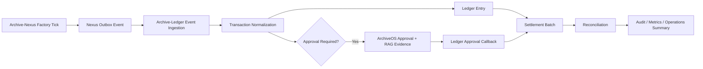

# Archive-Ledger Architecture

Archive-Ledger는 실제 사용자 금융 데이터를 다루지 않는다. 모든 입력은 Archive-Nexus가 만든 synthetic domain event이며, 계좌번호·카드번호·주민번호·전화번호 같은 실제 개인/금융 식별자는 금지한다.

## 책임 분리

- Archive-Nexus: 공장, 생산, 품질, 정비, 재고, 물류에서 발생한 일을 synthetic outbox event로 발행한다.
- Archive-Ledger: event를 비용·거래·원장·정산·대사·승인 관점으로 처리한다.
- ArchiveOS: policy evidence, human approval, audit, Slack/운영 알림, DEGRADED 상태 관제를 담당한다.

## Outbox Pattern

Nexus는 `nexus_outbox_event`에 event를 먼저 저장한다. Ledger 장애가 있어도 제조 API는 실패하지 않는다. publish 실패 시 `PENDING_RETRY` 또는 `FAILED`로 남기며 `retry_count`, `last_error`를 기록한다.

## Idempotency

Ledger는 `received_event.event_id`, `received_event.idempotency_key`, `finance_transaction.source_event_id`에 unique 제약을 둔다. 동일 event가 재전송되어도 transaction과 ledger entry는 한 번만 생성된다.

## Double-entry Ledger

각 transaction은 debit/credit ledger entry를 생성한다.

예: 4,800,000 KRW 정비비

| 방향 | 계정 | 금액 |
| --- | --- | ---: |
| 차변 | MAINTENANCE_EXPENSE | 4,800,000 |
| 대변 | ACCOUNTS_PAYABLE | 4,800,000 |

## Settlement Batch

Daily settlement는 `SETTLEMENT_READY` transaction만 포함한다. `APPROVAL_REQUIRED`, `REJECTED`, `FAILED`는 제외한다. 성공 시 transaction은 `SETTLED`가 되고 settlement detail과 audit log가 남는다.

## Reconciliation

대사는 received event, created transaction, duplicate, failed, approval required, settlement ready, settled, mismatch count를 집계한다.

- OK: mismatch = 0
- WARNING: mismatch > 0 and failed count is known
- CRITICAL: received count가 비정상적으로 낮거나 batch 실패

## Approval / RAG Evidence

고액/위험 거래는 ArchiveOS external approval로 전달된다. OpenAI/RAG가 unavailable이면 ArchiveOS는 synthetic policy rule fallback evidence를 저장하고 approval API 자체는 계속 동작한다.

## 장애 격리

- Ledger down: Nexus outbox는 retry 상태로 남고 제조 API는 계속 응답한다.
- ArchiveOS down: Ledger transaction/ledger entry 생성은 계속 가능하며 approval request는 내부 `approval_request`에 남는다.
- LLM/RAG down: ArchiveOS는 DEGRADED evidence fallback을 사용한다.

## Metrics

- `ledger_events_received_total`
- `ledger_duplicate_events_total`
- `ledger_transactions_created_total`
- `ledger_approval_required_total`
- `ledger_settlement_completed_total`
- `ledger_reconciliation_mismatch_total`
- `ledger_event_processing_failure_total`
- `ledger_settlement_duration_seconds`
